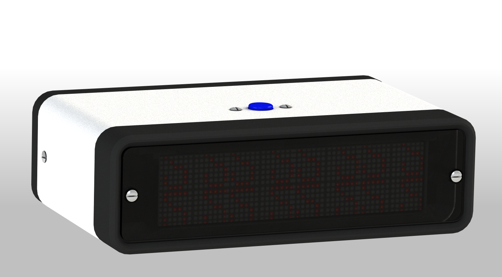

LED matrix clock
================

3D printed LED matrix clock based on ESP8266.

[Physical parts](parts/README.md)

[Firmware](firmware/README.md)

[Server-side software](https://github.com/kapitanov/miot-hub)